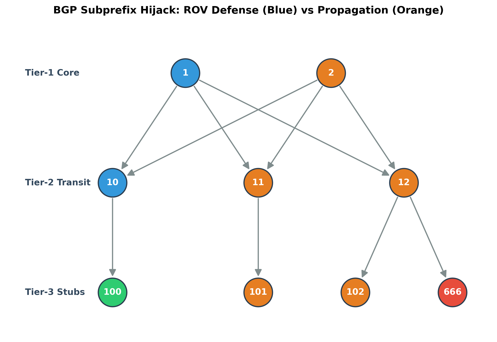

# High-Performance BGP Simulator (Singularity Edition)

A heterogeneous CPU/GPU implementation of a Border Gateway Protocol (BGP) simulator for modeling
Internet routing behavior at global scale. Built in C++17 and CUDA, with a PyBind11 extension for
driving the C++ engine directly from Python.

The CPU engine placed 1st in competitive benchmarking, processing 78k+ ASes in under 0.8 seconds on
just 2 CPU cores.

> **Status:** the CUDA engine is in development. It builds and runs, but does not yet parse input
> files or serialize a RIB, so it is not benchmarked against the CPU path. See
> [CUDA engine status](#cuda-engine-status) below.

---

## Architecture

The simulator is built around a data-oriented design rather than an object graph, which keeps route
state contiguous and cache-resident under load.

- **Struct-of-Arrays route state** — AS relationships and announcements are stored as parallel
  arrays, not as per-AS objects, eliminating pointer chasing during propagation.
- **Huge-page backed arena** — a custom aligned allocator requests 2 MB huge pages and falls back
  gracefully to standard aligned allocation when they are unavailable.
- **CUDA engine (in development)** — `main.cu` implements GPU-side graph propagation. Host-side
  file parsing and RIB writeback are not yet wired up.
- **PyBind11 bindings** — `main.cpp` compiles a second time as a Python extension module, exposing
  the engine as `bgp_simulator.run()` with no subprocess overhead.

---

## Requirements

| Component | Requirement |
|---|---|
| Compiler | g++ with C++17 support |
| CUDA | NVIDIA CUDA Toolkit, compute capability 8.6 or newer |
| Python | 3.8+ with `pybind11` installed |
| Testing | GoogleTest (`libgtest-dev`), `pytest` |

Install the Python-side build dependency:

```bash
pip install pybind11
```

If your GPU is not Ampere-class, adjust `NVCCFLAGS` in the `Makefile`:

```make
NVCCFLAGS = -O3 -std=c++17 -arch=sm_89   # Ada (RTX 40-series)
```

---

## Huge Pages

The allocator is designed around 2 MB huge pages. Without them it still runs correctly, but falls
back to standard pages and loses a meaningful amount of throughput on large topologies. Reserve
them before a benchmark run:

```bash
sudo sysctl -w vm.nr_hugepages=1024
```

That reserves 2 GB. To make it persist across reboots, add `vm.nr_hugepages = 1024` to
`/etc/sysctl.conf`.

---

## Building

```bash
make            # builds CPU binary, GPU binary, and Python extension
make bgp_simulator   # CPU only
make bgp_sim_gpu     # GPU only
make clean
```

Targets produced:

| Target | Output |
|---|---|
| `bgp_simulator` | CPU engine |
| `bgp_sim_gpu` | CUDA engine |
| `bgp_simulator*.so` | PyBind11 extension module |
| `test_memory` | GoogleTest allocator suite |

---

## Usage

### Command line

```bash
./bgp_simulator --relationships rel.txt --announcements ann.txt
```

Results are written to `ribs.csv` as `asn,prefix,as_path`:

```
asn,prefix,as_path
1,192.168.1.0/24,"(1,)"
2,192.168.1.0/24,"(2, 1)"
3,192.168.1.0/24,"(3, 2, 1)"
```

The GPU binary accepts the same flags but currently ignores them — see below.

### From Python

```python
import bgp_simulator

bgp_simulator.run(
    relationships="rel.txt",
    announcements="ann.txt",
    rov_asns="",
)
```

### Input format

`rel.txt` — one AS relationship per line, pipe-delimited, where `0` denotes a peer-to-peer link and
`-1` denotes provider-to-customer:

```
1|2|0
2|3|-1
```

`ann.txt` — one announcement per line as `origin_asn,prefix,timestamp`:

```
1,192.168.1.0/24,0
```

---

## Generating Test Data

```bash
python3 generate_data.py         # large synthetic topology tuned for ~14 GB route state
python3 generate_edge_cases.py   # infinite-loop and disconnected-island topologies
```

`generate_edge_cases.py` produces `ann_island.txt` / `rel_island.txt` and the loop topology used to
verify that path-vector loop detection terminates correctly on adversarial input.

---

## Testing

```bash
make test                    # GoogleTest allocator suite
pytest test_pipeline.py -v   # end-to-end CPU and GPU pipeline
python3 test_python_binding.py
python3 stress_test.py       # 500k-route soak test
```

The allocator suite covers huge-page fallback and free, aligned allocation at standard sizes, and
dynamic growth of the struct-of-arrays backing store.

---

## Benchmarking & Analysis

| Script | Purpose |
|---|---|
| `benchmark.py` | General throughput harness |
| `caida_benchmark.py` | Benchmarks against real CAIDA AS-relationship datasets |
| `lpm_churn_sim.py` | Longest-prefix-match behavior under route churn |
| `simulate_internet_rov.py` | Route Origin Validation deployment simulation |
| `visualize_hijack.py` | Renders prefix-hijack propagation graphs |



---

## Repository Layout

```
main.cpp                  CPU engine + PyBind11 module
main.cu                   CUDA engine
test_memory.cpp           GoogleTest allocator suite
Makefile                  CPU / GPU / Python build targets
compare_output.sh         Diffs CPU and GPU output for parity checking
```

---

## CUDA Engine Status

`main.cu` builds and executes GPU kernels, but the host side is incomplete:

- Command-line arguments are accepted and discarded; `--relationships` and `--announcements` have
  no effect on what the kernel processes.
- No RIB is serialized, so `ribs.csv` is not produced by the GPU path.
- Reported kernel times therefore do not scale with input size and are not comparable to CPU
  timings.

Remaining work: parse the relationship and announcement files host-side, upload the topology to
device memory, and write the resulting RIB back out in the same `asn,prefix,as_path` format the CPU
engine emits. Once that lands, `test_cpu_gpu_output_parity` in `test_pipeline.py` will verify the
two engines agree, and `compare_output.sh` can diff their output on a shared dataset.

## Notes on Benchmark Figures

The 78k-AS / 0.8-second figure is measured on CAIDA topology data on 2 CPU cores with huge pages
reserved. Timings vary meaningfully with huge-page availability, so reserve them before comparing
runs.